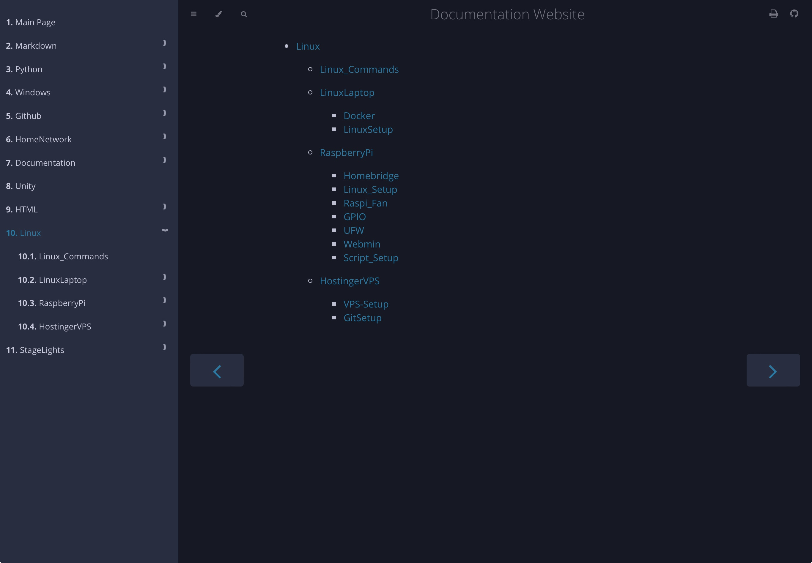

# MdBook with auto index and SUMMARY



## Instalation

Install Rust `curl -sSf https://sh.rustup.rs | sh` \

Install MdBook `cargo install mdbook`

## Setup

Clone this repo  
`git clone https://github.com/pIlIp-d/mdbook-auto-SUMMARY`

run `mdbook init`

edit `book.toml`

```config
[book]
authors = ["Philip Dell"]
title = "Documentation Website"
language = "en"
multilingual = false
src = "src"

[output.html.fold]
enable = true

[output.html]
git-repository-url = "https://github.com/pilip-d"

```

instead of `mdbook watch` run ./notify.sh

### Deamonize

create `/lib/systemd/system/mdbook-auto-build.service`
```config
[Unit]
Description = Change listener to build Documentation Website(mdBook)

[Service]
User=pi
Group=pi
ExecStart=/var/www/website/notify.sh
RestartSec=10

[Install]
WantedBy=multi-user.target
```
run \
`sudo chmod +x /lib/systemd/system/mdbook-auto-build.service` \
`sudo systemctl daemon-reload` \
`sudo systemctl enable mdbook-auto-build` \
`sudo systemctl start mdbook-auto-build`

## Usage

place `.md` Files in Folders into `src/` \

use samba share or git to sync files \

place images into src/... only
